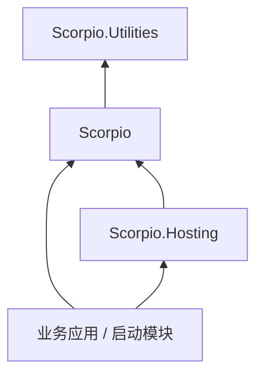
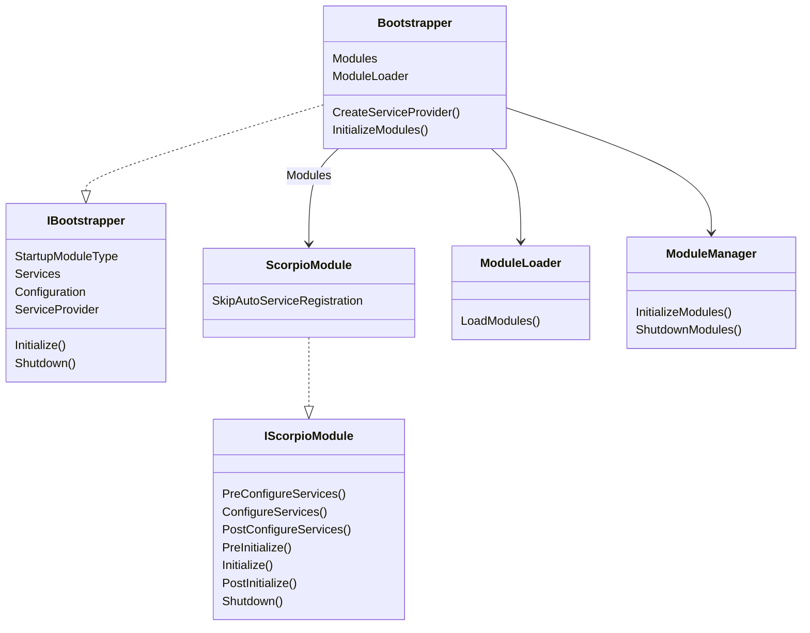
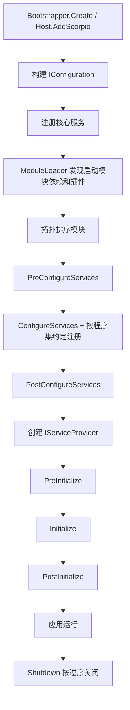

# Scorpio.Core 架构说明

本文档描述 Scorpio.Core 的总体架构、模块与程序集关系、启动流程、核心机制和设计边界，供后续开发与扩展时统一认知。

## 1. 程序集分层

| 程序集 | 主要职责 | 典型命名空间 |
| --- | --- | --- |
| `Scorpio.Utilities` | 零业务语义的通用工具：校验、集合、字符串、反射、表达式、异步 LINQ、中间件管道 | `Scorpio`、`System.*`、`Microsoft.Extensions.Logging` |
| `Scorpio` | 框架核心：引导、模块、DI 约定、插件、AOP 抽象、Options、异常、初始化、运行时 | `Scorpio`、`Scorpio.*`、`Microsoft.Extensions.DependencyInjection` |
| `Scorpio.Hosting` | 将核心引导程序接入 .NET Generic Host | `Scorpio`、`Microsoft.Extensions.Hosting` |

依赖方向是单向的：`Scorpio.Hosting -> Scorpio -> Scorpio.Utilities`。

## 2. 核心对象关系

`Bootstrapper` 是编排者，`ModuleLoader` 负责发现与排序模块，`ModuleManager` 负责执行模块生命周期。

## 3. 启动流程

### 3.1 服务配置阶段

1. `KernelModule` 最先执行 `PreConfigureServices`，替换 `IOptionsFactory<>` 并注册 `BasicConventionalRegistrar`、`InitializationConventionalRegistrar`。
2. 按模块依赖顺序执行各模块的 `PreConfigureServices`。
3. 执行 `BootstrapperCreationOptions.PreConfigureServices`。
4. 按模块依赖顺序执行 `ConfigureServices`；对于未跳过自动注册的 `ScorpioModule`，框架会扫描该模块程序集并执行约定注册。
5. 执行 `BootstrapperCreationOptions.ConfigureServices`。
6. 按模块依赖顺序执行 `PostConfigureServices`，再执行 `BootstrapperCreationOptions.PostConfigureServices`。

### 3.2 初始化阶段

`Bootstrapper.Initialize()` 创建作用域，并把 `ApplicationInitializationContext` 交给 `IModuleManager`。模块管理器依次执行：

1. 所有模块的 `PreInitialize`
2. 所有模块的 `Initialize`
3. 所有模块的 `PostInitialize`

因此阶段内先执行依赖模块，再执行被依赖模块；阶段之间也保持依赖顺序。

### 3.3 关闭阶段

`Bootstrapper.Shutdown()` 创建作用域，并由 `ModuleManager` 以相反顺序执行模块 `Shutdown`。`Bootstrapper.Dispose()` 也会调用 `Shutdown()`。

## 4. 模块发现与排序

### 4.1 模块发现

`ModuleLoader` 从启动模块出发：

1. 通过 `ModuleHelper.FindAllModuleTypes` 递归解析 `[DependsOn]`。
2. 从 `IPlugInSourceList` 收集插件模块，跳过已存在的模块。
3. 为每个模块创建实例，并注册为单例。

### 4.2 排序规则

`SortByDependencies` 执行拓扑排序，检测循环依赖；随后：

- 将 `KernelModule` 移到第一位。
- 将启动模块移到最后一位。

这样保证框架核心最先初始化、应用入口最后初始化。

## 5. 依赖注入与约定注册

`KernelModule` 注册两个基础约定注册器：

- `BasicConventionalRegistrar`：处理生命周期标记接口和 `[ExposeServices]`。
- `InitializationConventionalRegistrar`：自动发现并注册 `IInitializable`。

`Bootstrapper` 会在每个未跳过的模块 `ConfigureServices` 前，对该模块程序集执行 `RegisterAssemblyByConvention`。

默认 `BasicConventionalRegistrar` 规则：

| 条件 | 选择器 | 生命周期 |
| --- | --- | --- |
| 实现 `ISingletonDependency` | `DefaultInterfaceSelector`（同名接口 + 自身） | Singleton |
| 实现 `ITransientDependency` | `DefaultInterfaceSelector` | Transient |
| 实现 `IScopedDependency` | `DefaultInterfaceSelector` | Scoped |
| 有 `[ExposeServices]` | `ExposeServicesSelector` | 特性指定，默认 Transient |

自定义约定注册可通过 `IConventionalRegistrar` 扩展，并用 `context.AddConventionalRegistrar(...)` 注册。

## 6. Generic Host 集成机制

`Scorpio.Hosting` 的 `ServiceProviderFactory` 实现 `IServiceProviderFactory<IServiceCollection>`：

1. `CreateBuilder` 创建 `InternalBootstrapper`，将 `IHostEnvironment` 存入 `Properties["HostingEnvironment"]`。
2. `CreateServiceProvider` 使用 `InternalBootstrapper` 创建实际容器，注册停止回调并调用 `Initialize()`。
3. `ApplicationStopping` 触发 `Shutdown()`；`ApplicationStopped` 触发释放。

这使 Scorpio 模块系统能无缝使用 .NET 的配置、日志、托管服务和生命周期。

## 7. 插件机制

`IPlugInSource.GetModules()` 抽象模块来源，内置三种实现：

| 实现 | 说明 |
| --- | --- |
| `TypePlugInSource` | 直接提供内存中的模块类型 |
| `FilePlugInSource` | 从指定程序集文件发现模块 |
| `FolderPlugInSource` | 扫描目录，通过 `IFileProvider` 和 `AssemblyLoadContext` 加载 |

插件模块与依赖模块统一参与排序，但在 `IModuleDescriptor.IsLoadedAsPlugIn` 中被标记为插件来源。

## 8. AOP 设计边界

框架提供拦截器抽象和约定式拦截配置，但不实现具体代理。实际拦截由外部 DI 容器的动态代理能力接入。相关组件：

- `IInterceptor` / `IMethodInvocation`：拦截器契约与调用上下文。
- `IMethodInvocationRuntimeExtensions.IsAsync`：异步方法判断。
- `IProxyTargetProvider` / `ProxyHelper`：识别并还原代理目标。
- `ConventionalInterceptorAction` / `ConventionalInterceptorExtensions`：约定式注册拦截器。

这一分层使框架不绑定某个代理库，但使用方必须提供 `IProxyConventionalAction` 或等价接入。

## 9. 扩展点

| 扩展点 | 入口 |
| --- | --- |
| 自定义模块 | 继承 `ScorpioModule` |
| 模块依赖 | `[DependsOn]` |
| 插件来源 | 实现 `IPlugInSource` 或使用内置源 |
| 自定义约定注册 | 实现 `IConventionalRegistrar` |
| 服务工厂 | `BootstrapperCreationOptions.UseServiceProviderFactory<TContainerBuilder>()` |
| Options 阶段 | `IPreConfigureOptions<>` / `IConfigureOptions<>` / `IPostConfigureOptions<>` |
| 排序初始化 | 实现 `IInitializable` + `[InitializationOrder]` |
| 异常订阅 | 继承 `ExceptionSubscriber` |
| 拦截器抽象 | 实现 `IInterceptor` |

## 10. 设计原则

- 模块优先：功能边界以模块划分，依赖显式声明。
- 约定优于配置：标记接口、命名匹配和程序集扫描减少样板注册代码。
- 框架与宿主解耦：核心不依赖 Generic Host，宿主层只做适配。
- 可替换容器：通过 `IServiceFactoryAdapter` 和 `UseServiceProviderFactory` 隔离 DI 容器。
- 多目标兼容：公共代码同时支持 `netstandard2.0` 与 `net5.0` ~ `net10.0`。
