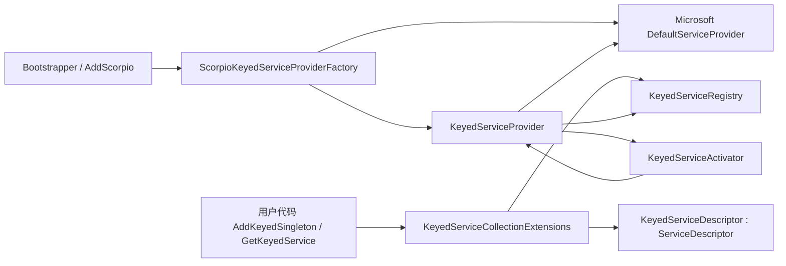

# 键控服务兼容层技术实现方案

## 1. 目标

为 `netstandard2.0`、`net5.0`、`net6.0`、`net7.0` 目标提供与 .NET 8 原生键控服务一致的使用方式和运行行为，且不升级 `Microsoft.Extensions.DependencyInjection` 包版本。

实现范围：

- 标准 API：`AddKeyedSingleton` / `AddKeyedScoped` / `AddKeyedTransient`。
- 标准解析 API：`GetKeyedService` / `GetRequiredKeyedService` / `GetKeyedServices`。
- 标准特性：`[FromKeyedServices]` / `[ServiceKey]`。
- 标准辅助类型：`KeyedService.AnyKey`、`IKeyedServiceProvider`、`IServiceProviderIsKeyedService`。
- 构造注入、作用域生命周期、开放泛型、`AnyKey`、`null` key。

## 2. 约束

- 不在 `Directory.Packages.props` 中升级 `Microsoft.Extensions.DependencyInjection`。
- 所有兼容类型仅在 `#if !NET8_0_OR_GREATER` 下编译。
- `net8.0` 及以上使用原生键控服务，不产生同名同命名空间类型。
- 代码遵循现有项目风格：block namespace、中文 XML 注释、不使用可空引用类型注解。

## 3. 总体架构



核心思想：

1. 键控注册不进入 Microsoft 默认容器的普通解析空间。
2. 键控描述符用 `KeyedServiceDescriptor` 保存，派生自 `ServiceDescriptor`。
3. `KeyedServiceRegistry` 是键控服务的事实来源。
4. `KeyedServiceProvider` 包装普通 `IServiceProvider`，在普通解析之外提供键控解析。
5. `KeyedServiceActivator` 负责键控感知构造注入。

## 4. 条件编译策略

所有键控兼容源文件使用：

```csharp
#if !NET8_0_OR_GREATER
// 键控服务兼容实现
#endif
```

`net8.0`、`net9.0`、`net10.0` 构建中不会包含这些类型，避免和官方类型冲突。

## 5. 公开 API 实现

### 5.1 命名空间

公开类型使用 `Microsoft.Extensions.DependencyInjection`，与 .NET 8 一致。

```text
src/Scorpio/Microsoft/Extensions/DependencyInjection/
```

### 5.2 KeyedService

```csharp
public static class KeyedService
{
    private static readonly object AnyKeyValue = new AnyKeyObject();

    public static object AnyKey => AnyKeyValue;

    private sealed class AnyKeyObject
    {
        public override string ToString() => "*";
    }
}
```

### 5.3 FromKeyedServicesAttribute

```csharp
[AttributeUsage(AttributeTargets.Parameter)]
public sealed class FromKeyedServicesAttribute : Attribute
{
    public FromKeyedServicesAttribute(object key)
    {
        Key = key;
    }

    public object Key { get; }
}
```

### 5.4 ServiceKeyAttribute

```csharp
[AttributeUsage(AttributeTargets.Parameter)]
public sealed class ServiceKeyAttribute : Attribute
{
}
```

### 5.5 IKeyedServiceProvider

```csharp
public interface IKeyedServiceProvider : IServiceProvider
{
    object GetKeyedService(Type serviceType, object serviceKey);
    object GetRequiredKeyedService(Type serviceType, object serviceKey);
}
```

### 5.6 IServiceProviderIsKeyedService

```csharp
public interface IServiceProviderIsKeyedService
{
    bool IsKeyedService(Type serviceType, object serviceKey);
}
```

### 5.7 KeyedServiceDescriptor

旧版 `ServiceDescriptor` 不是 sealed，因此可以继承。

```csharp
public sealed class KeyedServiceDescriptor : ServiceDescriptor
{
    public KeyedServiceDescriptor(
        Type serviceType,
        object serviceKey,
        Type implementationType,
        ServiceLifetime lifetime)
        : base(serviceType, implementationType, lifetime)
    {
        ServiceKey = serviceKey;
        KeyedImplementationType = implementationType;
    }

    public KeyedServiceDescriptor(
        Type serviceType,
        object serviceKey,
        object implementationInstance)
        : base(serviceType, implementationInstance)
    {
        ServiceKey = serviceKey;
        KeyedImplementationInstance = implementationInstance;
    }

    public KeyedServiceDescriptor(
        Type serviceType,
        object serviceKey,
        Func<IServiceProvider, object, object> implementationFactory,
        ServiceLifetime lifetime)
        : base(serviceType, provider => implementationFactory(provider, serviceKey), lifetime)
    {
        ServiceKey = serviceKey;
        KeyedImplementationFactory = implementationFactory;
    }

    public object ServiceKey { get; }
    public Type KeyedImplementationType { get; }
    public object KeyedImplementationInstance { get; }
    public Func<IServiceProvider, object, object> KeyedImplementationFactory { get; }
    public bool IsKeyedService => true;
}
```

说明：

- 基类构造只是为了让对象满足 `ServiceDescriptor` 类型，实际解析使用 `Keyed*` 属性。
- 单例实例、类型、工厂三种形式都通过该类型表达。
- `ServiceKey` 允许为 `null`。

### 5.8 注册扩展

扩展类放在 `Microsoft.Extensions.DependencyInjection` 命名空间，但类名使用 Scorpio 专属名称，避免与官方静态类重名：

```csharp
public static class KeyedServiceCollectionExtensions
{
}
```

需要实现的重载与 .NET 8 对齐，例如：

```csharp
public static IServiceCollection AddKeyedSingleton<TService>(
    this IServiceCollection services,
    object serviceKey)
{
}

public static IServiceCollection AddKeyedSingleton<TService>(
    this IServiceCollection services,
    object serviceKey,
    TService implementationInstance)
{
}

public static IServiceCollection AddKeyedSingleton<TService, TImplementation>(
    this IServiceCollection services,
    object serviceKey)
    where TService : class
    where TImplementation : class, TService
{
}
```

同时实现：

- `AddKeyedScoped`
- `AddKeyedTransient`
- `TryAddKeyedSingleton`
- `TryAddKeyedScoped`
- `TryAddKeyedTransient`
- `RemoveAllKeyed<TService>`
- `RemoveAllKeyed(Type serviceType, object serviceKey)`

### 5.9 解析扩展

```csharp
public static class KeyedServiceProviderExtensions
{
    public static T GetKeyedService<T>(this IServiceProvider provider, object serviceKey);
    public static object GetKeyedService(this IServiceProvider provider, Type serviceType, object serviceKey);
    public static T GetRequiredKeyedService<T>(this IServiceProvider provider, object serviceKey);
    public static object GetRequiredKeyedService(this IServiceProvider provider, Type serviceType, object serviceKey);
    public static IEnumerable<T> GetKeyedServices<T>(this IServiceProvider provider, object serviceKey);
    public static IEnumerable<object> GetKeyedServices(this IServiceProvider provider, Type serviceType, object serviceKey);
}
```

实现逻辑：

```csharp
public static object GetKeyedService(this IServiceProvider provider, Type serviceType, object serviceKey)
{
    if (provider is IKeyedServiceProvider keyedProvider)
    {
        return keyedProvider.GetKeyedService(serviceType, serviceKey);
    }

    return null;
}
```

## 6. 内部注册表

### 6.1 ServiceIdentifier

```csharp
internal readonly struct ServiceIdentifier : IEquatable<ServiceIdentifier>
{
    public ServiceIdentifier(Type serviceType, object serviceKey)
    {
        ServiceType = serviceType;
        ServiceKey = serviceKey;
    }

    public Type ServiceType { get; }
    public object ServiceKey { get; }
}
```

### 6.2 KeyedServiceKeyComparer

使用对象相等性：

```csharp
internal sealed class KeyedServiceKeyComparer : IEqualityComparer<object>
{
    public new bool Equals(object x, object y)
    {
        if (ReferenceEquals(x, y))
        {
            return true;
        }

        if (x is null || y is null)
        {
            return false;
        }

        return x.Equals(y);
    }

    public int GetHashCode(object obj)
    {
        return obj?.GetHashCode() ?? 0;
    }
}
```

### 6.3 KeyedServiceRegistry

```csharp
internal sealed class KeyedServiceRegistry
{
    private readonly Dictionary<ServiceIdentifier, List<KeyedServiceDescriptor>> _descriptors =
        new Dictionary<ServiceIdentifier, List<KeyedServiceDescriptor>>();

    private readonly object _sync = new object();

    public void Add(KeyedServiceDescriptor descriptor);
    public bool TryAdd(KeyedServiceDescriptor descriptor);
    public void RemoveAll(Type serviceType, object serviceKey);
    public IReadOnlyList<KeyedServiceDescriptor> Get(Type serviceType, object serviceKey);
    public IReadOnlyList<KeyedServiceDescriptor> GetAll();
}
```

`ServiceIdentifier` 的相等性由 `ServiceType` 和 `KeyedServiceKeyComparer` 决定。

注册表通过 `ConditionalWeakTable<IServiceCollection, KeyedServiceRegistry>` 附加：

```csharp
internal static class KeyedServiceRegistryAccessor
{
    private static readonly ConditionalWeakTable<IServiceCollection, KeyedServiceRegistry> Registries =
        new ConditionalWeakTable<IServiceCollection, KeyedServiceRegistry>();

    public static KeyedServiceRegistry GetOrCreate(IServiceCollection services);
}
```

使用 `ConditionalWeakTable` 可以避免在服务集合中暴露内部单例，也不影响普通容器解析。

## 7. 注册流程

`AddKeyedSingleton<TService, TImplementation>(services, key)` 的伪代码：

```csharp
var descriptor = new KeyedServiceDescriptor(
    typeof(TService),
    key,
    typeof(TImplementation),
    ServiceLifetime.Singleton);

KeyedServiceRegistryAccessor.GetOrCreate(services).Add(descriptor);
return services;
```

`TryAddKeyedSingleton`：

```csharp
var registry = KeyedServiceRegistryAccessor.GetOrCreate(services);
if (registry.Contains(serviceType, serviceKey))
{
    return;
}

registry.Add(descriptor);
```

`RemoveAllKeyed`：

```csharp
KeyedServiceRegistryAccessor.GetOrCreate(services).RemoveAll(serviceType, serviceKey);
return services;
```

键控描述符不直接加入 `IServiceCollection`，避免旧版 Microsoft 容器把它作为普通服务解析。

## 8. 服务提供者包装

### 8.1 KeyedServiceProvider

```csharp
internal sealed class KeyedServiceProvider :
    IServiceProvider,
    IKeyedServiceProvider,
    IServiceProviderIsKeyedService,
    IServiceProviderIsService,
    IDisposable
{
}
```

成员：

```csharp
private readonly IServiceProvider _inner;
private readonly KeyedServiceRegistry _registry;
private readonly KeyedServiceActivator _activator;
private readonly bool _validateScopes;
private readonly ConcurrentDictionary<ServiceIdentifier, object> _singletons;
```

普通解析：

```csharp
public object GetService(Type serviceType) => _inner.GetService(serviceType);
```

键控解析：

```csharp
public object GetKeyedService(Type serviceType, object serviceKey)
    => ResolveKeyed(serviceType, serviceKey, throwIfNotFound: false, scope: null);

public object GetRequiredKeyedService(Type serviceType, object serviceKey)
    => ResolveKeyed(serviceType, serviceKey, throwIfNotFound: true, scope: null);
```

`IsKeyedService`：

```csharp
public bool IsKeyedService(Type serviceType, object serviceKey)
    => _registry.Get(serviceType, serviceKey).Count > 0;
```

### 8.2 ResolveKeyed

伪代码：

```csharp
private object ResolveKeyed(
    Type serviceType,
    object serviceKey,
    bool throwIfNotFound,
    KeyedServiceScope scope)
{
    var descriptors = FindKeyedDescriptors(serviceType, serviceKey);

    if (descriptors.Count == 0 && throwIfNotFound)
    {
        throw new InvalidOperationException(
            $"No service for type '{serviceType}' has been registered.");
    }

    if (descriptors.Count == 0)
    {
        return null;
    }

    var descriptor = descriptors[descriptors.Count - 1];
    return CreateKeyedInstance(descriptor, serviceType, serviceKey, scope);
}
```

### 8.3 FindKeyedDescriptors

```csharp
private IReadOnlyList<KeyedServiceDescriptor> FindKeyedDescriptors(
    Type serviceType,
    object serviceKey)
{
    var exact = _registry.Get(serviceType, serviceKey);
    if (exact.Count > 0)
    {
        return exact;
    }

    return _registry.Get(serviceType, KeyedService.AnyKey);
}
```

如果请求类型是封闭泛型，需要先匹配开放泛型注册：

```csharp
if (serviceType.IsGenericType && !serviceType.IsGenericTypeDefinition)
{
    var open = FindOpenGenericDescriptor(serviceType, serviceKey);
    if (open != null)
    {
        return new[] { open };
    }
}
```

### 8.4 CreateKeyedInstance

根据生命周期：

```csharp
private object CreateKeyedInstance(
    KeyedServiceDescriptor descriptor,
    Type serviceType,
    object serviceKey,
    KeyedServiceScope scope)
{
    switch (descriptor.Lifetime)
    {
        case ServiceLifetime.Singleton:
            return _singletons.GetOrAdd(
                new ServiceIdentifier(serviceType, serviceKey),
                _ => CreateCore(descriptor, serviceType, serviceKey, scope));

        case ServiceLifetime.Scoped:
            return scope != null
                ? scope.GetOrAdd(serviceType, serviceKey, () => CreateCore(...))
                : ResolveScopedFromRoot(...);

        default:
            return CreateCore(descriptor, serviceType, serviceKey, scope);
    }
}
```

`CreateCore`：

```csharp
private object CreateCore(
    KeyedServiceDescriptor descriptor,
    Type serviceType,
    object serviceKey,
    KeyedServiceScope scope)
{
    if (descriptor.KeyedImplementationInstance != null)
    {
        return descriptor.KeyedImplementationInstance;
    }

    if (descriptor.KeyedImplementationFactory != null)
    {
        return descriptor.KeyedImplementationFactory(this, serviceKey);
    }

    return _activator.CreateInstance(
        descriptor.KeyedImplementationType,
        serviceType,
        serviceKey,
        scope?.ServiceProvider ?? this);
}
```

## 9. 作用域与释放

### 9.1 KeyedServiceScope

```csharp
internal sealed class KeyedServiceScope : IServiceScope
{
    private readonly IServiceScope _inner;
    private readonly KeyedServiceProvider _root;
    private readonly KeyedServiceRegistry _registry;
    private readonly Dictionary<ServiceIdentifier, object> _scopedInstances;

    public IServiceProvider ServiceProvider { get; }

    public void Dispose()
    {
        DisposeScopedInstances();
        _inner.Dispose();
    }
}
```

`ServiceProvider` 使用 `KeyedServiceScopeProvider` 或同一个 `KeyedServiceProvider` 的 scope 模式，将 `KeyedServiceScope` 传入解析过程。

### 9.2 根容器解析 Scoped 键控服务

如果 `ServiceProviderOptions.ValidateScopes` 为 true，且当前没有作用域，则抛出标准 `InvalidOperationException`。

## 10. 构造注入

### 10.1 KeyedServiceActivator

```csharp
internal sealed class KeyedServiceActivator
{
    public object CreateInstance(
        Type implementationType,
        Type serviceType,
        object serviceKey,
        IServiceProvider serviceProvider)
    {
    }
}
```

实现步骤：

1. 获取公共实例构造函数。
2. 按 Microsoft DI 规则选择构造函数。
3. 遍历参数：
   - 普通参数：`serviceProvider.GetService(parameterType)`。
   - `[FromKeyedServices(key)]` 参数：`serviceProvider.GetKeyedService(parameterType, key)`。
   - `[ServiceKey]` 参数：注入 `serviceKey`。
4. 参数缺失且无默认值时，按构造函数不可用处理。
5. 使用反射或编译后的委托创建实例。

### 10.2 普通服务中的键控构造注入

旧版 Microsoft 容器不识别 `[FromKeyedServices]`，因此需要预处理服务集合。

`ScorpioKeyedServiceProviderFactory.CreateBuilder` 执行：

```csharp
foreach (var descriptor in services.ToList())
{
    if (descriptor.ImplementationType != null &&
        RequiresKeyedAwareActivation(descriptor.ImplementationType))
    {
        var replacement = ServiceDescriptor.Describe(
            descriptor.ServiceType,
            sp => _activator.CreateInstance(
                descriptor.ImplementationType,
                descriptor.ServiceType,
                null,
                sp),
            descriptor.Lifetime);

        preparedServices.Remove(descriptor);
        preparedServices.Add(replacement);
    }
}
```

`RequiresKeyedAwareActivation`：

```csharp
private static bool RequiresKeyedAwareActivation(Type implementationType)
{
    return implementationType
        .GetConstructors(BindingFlags.Instance | BindingFlags.Public)
        .SelectMany(c => c.GetParameters())
        .Any(p =>
            p.IsDefined(typeof(FromKeyedServicesAttribute), true) ||
            p.IsDefined(typeof(ServiceKeyAttribute), true));
}
```

注意：

- 只替换实现类型可确定的描述符。
- 实例和工厂描述符由用户负责，不自动改写。
- 开放泛型描述符暂不在预扫描阶段改写，可在闭合泛型解析时使用 `KeyedServiceActivator`。

## 11. 开放泛型支持

注册：

```csharp
services.AddKeyedTransient(typeof(IRepository<>), "sql", typeof(SqlRepository<>));
```

内部保存开放泛型 `KeyedServiceDescriptor`。

解析封闭泛型时：

```csharp
Type requestedType = typeof(IRepository<User>);
object key = "sql";

var openDescriptor = registry.Get(typeof(IRepository<>), key).FirstOrDefault();
var closedServiceType = openDescriptor.ServiceType.MakeGenericType(requestedType.GetGenericArguments());
var closedImplementationType = openDescriptor.KeyedImplementationType.MakeGenericType(requestedType.GetGenericArguments());
```

然后以闭合类型继续解析。

## 12. AnyKey 与 null key

- `KeyedService.AnyKey` 是私有单例 sentinel。
- 精确 key 优先。
- 没有精确 key 时匹配 `KeyedService.AnyKey`。
- `null` key 与 `AnyKey` 不是同一概念，注册表必须支持。
- `IsKeyedService` 通过独立 bool 标志判断，而不是 `ServiceKey != null`。

## 13. Scorpio Bootstrapper / Generic Host 集成

### 13.1 KeyedServiceProviderFactory

```csharp
internal sealed class KeyedServiceProviderFactory :
    IServiceProviderFactory<IServiceCollection>
{
    private readonly KeyedServiceRegistry _registry;

    public IServiceCollection CreateBuilder(IServiceCollection services)
    {
        _registry = KeyedServiceRegistryAccessor.GetOrCreate(services);

        var prepared = PrepareOrdinaryServices(services);
        return prepared;
    }

    public IServiceProvider CreateServiceProvider(IServiceCollection containerBuilder)
    {
        var inner = containerBuilder.BuildServiceProvider();
        return new KeyedServiceProvider(inner, _registry);
    }
}
```

### 13.2 BootstrapperCreationOptions

在 `!NET8_0_OR_GREATER` 下，默认服务工厂改为：

```csharp
ServiceFactory = () => new ServiceFactoryAdapter<IServiceCollection>(
    new KeyedServiceProviderFactory());
```

`net8.0` 及以上保持：

```csharp
ServiceFactory = () => new ServiceFactoryAdapter<IServiceCollection>(
    new DefaultServiceProviderFactory());
```

### 13.3 Generic Host

`Scorpio.Hosting` 的 `ServiceProviderFactory` 已经通过 `InternalBootstrapper.CreateServiceProvider` 创建容器，因此会自动使用 `KeyedServiceProviderFactory`，无需额外修改宿主扩展。

## 14. 与直接 BuildServiceProvider 的边界

标准 `services.BuildServiceProvider()` 是 Microsoft 扩展方法，无法被 Scorpio 安全替换。

因此：

- Scorpio 框架路径：`Bootstrapper.Create<T>()` 和 `AddScorpio<TStartupModule>()` 完整支持键控服务。
- 直接使用 `IServiceCollection` 的调用方：提供 `BuildKeyedServiceProvider()` 扩展作为显式入口。

```csharp
public static IServiceProvider BuildKeyedServiceProvider(this IServiceCollection services)
{
    return new KeyedServiceProviderFactory().CreateServiceProvider(
        new KeyedServiceProviderFactory().CreateBuilder(services));
}
```

不建议尝试覆盖原生 `BuildServiceProvider`，否则会产生扩展方法歧义。

## 15. 文件变更清单

新增：

```text
src/Scorpio/Microsoft/Extensions/DependencyInjection/KeyedService.cs
src/Scorpio/Microsoft/Extensions/DependencyInjection/FromKeyedServicesAttribute.cs
src/Scorpio/Microsoft/Extensions/DependencyInjection/ServiceKeyAttribute.cs
src/Scorpio/Microsoft/Extensions/DependencyInjection/IKeyedServiceProvider.cs
src/Scorpio/Microsoft/Extensions/DependencyInjection/IServiceProviderIsKeyedService.cs
src/Scorpio/Microsoft/Extensions/DependencyInjection/KeyedServiceDescriptor.cs
src/Scorpio/Microsoft/Extensions/DependencyInjection/KeyedServiceCollectionExtensions.cs
src/Scorpio/Microsoft/Extensions/DependencyInjection/KeyedServiceProviderExtensions.cs

src/Scorpio/Scorpio/DependencyInjection/KeyedServices/KeyedServiceRegistryAccessor.cs
src/Scorpio/Scorpio/DependencyInjection/KeyedServices/KeyedServiceRegistry.cs
src/Scorpio/Scorpio/DependencyInjection/KeyedServices/ServiceIdentifier.cs
src/Scorpio/Scorpio/DependencyInjection/KeyedServices/KeyedServiceKeyComparer.cs
src/Scorpio/Scorpio/DependencyInjection/KeyedServices/KeyedServiceActivator.cs
src/Scorpio/Scorpio/DependencyInjection/KeyedServices/KeyedServiceProvider.cs
src/Scorpio/Scorpio/DependencyInjection/KeyedServices/KeyedServiceScope.cs
src/Scorpio/Scorpio/DependencyInjection/KeyedServices/KeyedServiceProviderFactory.cs
```

修改：

```text
src/Scorpio/Scorpio/BootstrapperCreationOptions.cs
```

测试新增：

```text
test/Scorpio.Tests/Microsoft/Extensions/DependencyInjection/KeyedService_Tests.cs
test/Scorpio.Tests/Scorpio/DependencyInjection/KeyedServiceProviderFactory_Tests.cs
test/Scorpio.Tests/Scorpio/DependencyInjection/KeyedServiceActivator_Tests.cs
test/Scorpio.Hosting.Tests/KeyedServiceHost_Tests.cs
```

## 16. 线程安全与性能

- 注册阶段使用锁或单线程假设，构建完成后只读。
- Singleton 使用 `ConcurrentDictionary` 缓存。
- Scoped 缓存只在对应作用域内访问，不需要跨线程全局锁。
- `KeyedServiceActivator` 可缓存构造函数选择和参数解析元数据，避免每次反射。
- `GetKeyedService` 先查精确 key，再查 `AnyKey`，不遍历所有描述符。
- 开放泛型可缓存闭合类型映射。

## 17. 实现顺序

1. 添加公开类型和 `KeyedServiceDescriptor`。
2. 添加 `KeyedServiceRegistry` 和注册扩展。
3. 添加解析扩展和服务提供者包装，完成基本定位解析。
4. 添加 Singleton / Scoped / Transient 生命周期。
5. 添加 `KeyedServiceActivator` 和构造注入。
6. 添加普通服务预处理。
7. 添加开放泛型和 `AnyKey`。
8. 接入 `BootstrapperCreationOptions`。
9. 添加测试并执行多目标回归。
10. 更新技术文档。

## 18. 主要风险

- 普通服务预处理可能改变 Microsoft DI 的构造器选择结果，需要与原生行为对比测试。
- 反射创建实例的性能需要缓存。
- `ConditionalWeakTable` 在多目标框架中可用，但需要确认 `netstandard2.0` 的 BCL 行为。
- 标准命名空间可能与第三方框架的键控兼容层冲突；必要时通过独立程序集或特性开关隔离。
- 直接 `BuildServiceProvider` 不支持键控服务，需要文档明确说明。

## 19. 验收标准

以 [键控服务兼容方案需求文档](../requirements/keyed-services-compatibility.md) 第 8 章验收矩阵为准，并额外验证：

- `Bootstrapper.Create<T>()` 和 `AddScorpio<TStartupModule>()` 两条路径。
- `netstandard2.0` 测试目标、`net5.0`、`net6.0`、`net7.0`。
- `net8.0` 及以上不出现兼容类型冲突。
